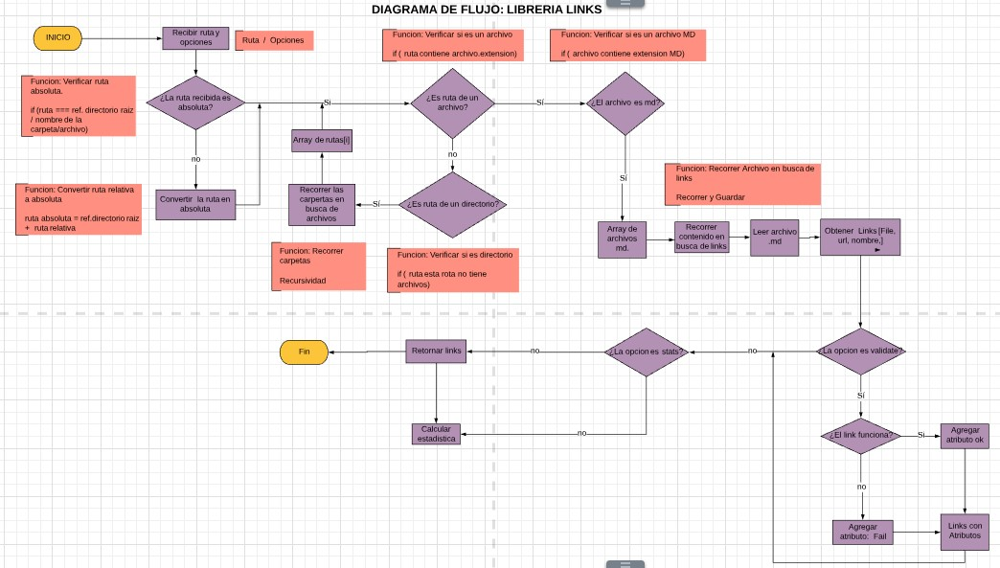
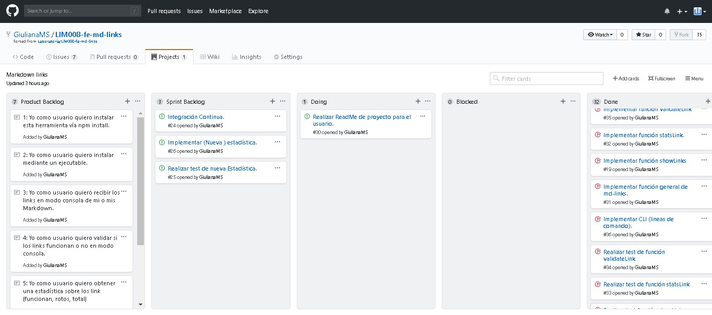
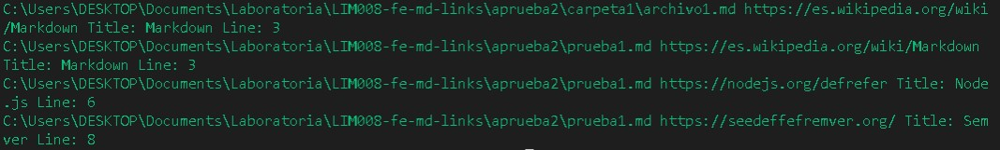
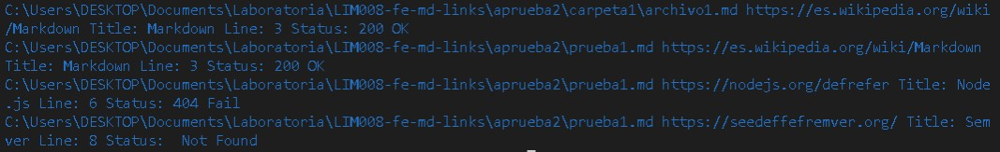
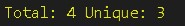
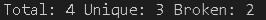

# Link digger


es una herramienta de utilidad, que te permite acceder a un archivo o directorio 
en busca de Markdowns los cuales pueden albergar links de mucha importancia, para
lo cual esta librería facilitara al usuario tener información de los links tanto 
como su descripción, validación y estadística.

## Planificación

Este proyecto empezó siendo planificado mediante un diagrama de flujo el cual 
nos mostrará los caminos que sigue nuestra librería una vez instalada o importada,
luego fue organizada en un Project en Github para medir tiempos y detallar funciones. 

### Diagrama de flujo



### Tablero



## Especificaciones Técnicas

### Argumentos

- `path`: Ruta absoluta o relativa al archivo o directorio. Si la ruta pasada es
  relativa, debe resolverse como relativa al directorio desde donde se invoca
  node - _current working directory_).
- `options`: Un objeto con las siguientes propiedades:
  * `validate`: Booleano que determina si se desea validar los links
    encontrados.

### Valor de retorno

La función debe retornar una promesa (`Promise`) que resuelva a un arreglo
(`Array`) de objetos (`Object`), donde cada objeto representa un link y contiene
las siguientes propiedades:

- `href`: URL encontrada.
- `text`: Texto que aparecía dentro del link (`<a>`).
- `file`: Ruta del archivo donde se encontró el link.

## Guia de uso

### Instalación

Paso 1: Instalar

```sh
$ npm install -d
```

Paso 2: Ingresar ruta

```sh
$ npm install -d
```



Paso 3: Ingresar opción validar = validate como ('--v' o '--validate')

```sh
$ npm install -d
```



Paso 4: Ingresar opción estadistica = stats como ('--v' o '--validate')

```sh
$ npm install -d
```



Paso 5: Ingresar opción estadistica y validate = stats como ('--v' o '--validate') y ('--s' o '--stats')

```sh
$ npm install -d
```



